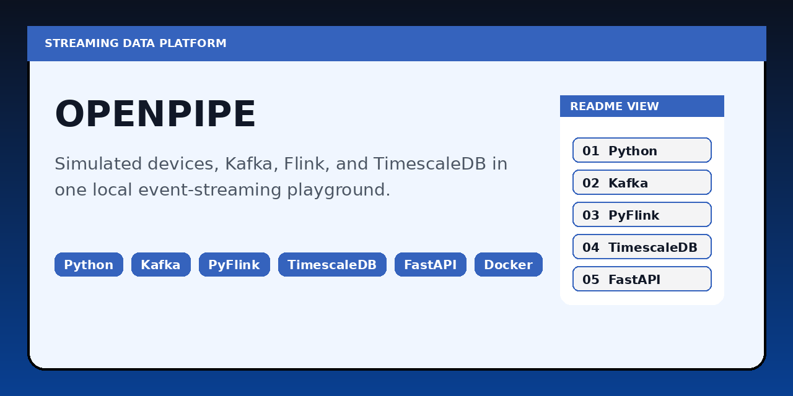

# OpenPipe



OpenPipe is a local-first streaming systems playground for simulating device events, moving them through Kafka, processing them with PyFlink, and storing time-series output in TimescaleDB.

It was built as a serious working environment for event-driven systems, not as a toy demo. The goal is to make ingestion, stream processing, observability, and query workflows visible in one place.

## What It Does

- Simulates wearable health telemetry, restaurant orders, and GPS movement
- Pushes events into Kafka topics with configurable bad-data injection
- Runs PyFlink jobs for windowed aggregation and alerting
- Persists pipeline output and alert data into TimescaleDB
- Exposes local dashboards for simulation monitoring, health checks, and SQL inspection

## System Layout

```text
Virtual Device Simulator -> Kafka -> Data Pipeline Service -> TimescaleDB
                               \
                                -> Flink Cluster -> Aggregations + Alerts -> TimescaleDB
```

## Services

| Service | Port | Purpose |
|---|---:|---|
| Kafka | 9092 | Event transport |
| TimescaleDB | 5432 | Time-series persistence |
| Simulator UI | 8080 | Device monitoring and control |
| Pipeline UI | 8081 | Data browsing and SQL queries |
| Kafka UI | 8082 | Topic inspection |
| Flink UI | 8083 | Job and stream-processing visibility |

## Event Domains

### Wearables
- Heart rate
- Blood pressure
- Blood sugar

### Restaurant Orders
- Table and order activity
- Dish codes
- Payment state

### GPS Telemetry
- Simulated route movement
- Position updates over time

## Stream Processing

OpenPipe currently focuses on health-event stream processing:

- 1-minute tumbling windows for heart rate
- 1-minute tumbling windows for blood pressure
- 10-minute tumbling windows for blood sugar
- Alert generation for elevated readings
- JDBC sink writes for aggregated metrics and alerts
- Standalone processor mode for environments where Flink is unavailable

## Why This Repo Exists

Most examples of stream-processing systems stop at “messages went through Kafka.” OpenPipe is meant to go further:

- simulate realistic event sources
- inspect raw messages
- process them with windowing logic
- persist the results
- query the output
- observe pipeline health while it runs

That makes it useful for learning, prototyping, and explaining how real-time data systems behave under more realistic conditions.

## Quick Start

### 1. Start infrastructure

```bash
docker-compose up -d
```

This starts Kafka, TimescaleDB, Kafka UI, and the Flink cluster.

### 2. Install Python dependencies

```bash
uv venv
uv pip install -r requirements.txt
```

PyFlink requires Java 11 or newer.

### 3. Run the simulator

```bash
uv run python -m virtual_devices.main --config config/settings.yaml
```

Open `http://localhost:8080`.

### 4. Run the pipeline service

```bash
uv run python -m data_pipeline.main --config config/settings.yaml
```

Open `http://localhost:8081`.

### 5. Run the stream processor

```bash
uv run python -m flink_processor.main --config config/settings.yaml
```

If you want to skip the Flink cluster:

```bash
uv run python -m flink_processor.main --config config/settings.yaml --standalone
```

Open `http://localhost:8083` to inspect the running Flink job.

## Health and Inspection

### Health endpoints

| Endpoint | Service | Purpose |
|---|---|---|
| `/health` | Simulator and pipeline | Overall health |
| `/health/live` | Simulator and pipeline | Liveness |
| `/health/ready` | Simulator and pipeline | Readiness |
| `/metrics` | Simulator | Prometheus metrics |

### Kafka topics

| Topic | Purpose |
|---|---|
| `virtual-wearables` | Health telemetry |
| `virtual-restaurants` | Restaurant events |
| `virtual-gps` | GPS telemetry |

### Output tables

| Table | Purpose |
|---|---|
| `health_metrics_1min` | 1-minute heart-rate and blood-pressure windows |
| `health_metrics_10min` | 10-minute blood-sugar windows |
| `health_alerts` | Elevated-reading alerts |

## Example Queries

```sql
SELECT * FROM health_metrics_1min
WHERE metric_type = 'heart_rate'
ORDER BY time DESC
LIMIT 10;

SELECT * FROM health_alerts
ORDER BY time DESC
LIMIT 20;
```

## Configuration

The main runtime configuration is in [config/settings.yaml](./config/settings.yaml).

It covers:

- simulator frequency and device counts
- bad-data probability
- Kafka and database connectivity
- pipeline batch and flush behavior
- GPS route definitions
- Flink execution mode, window sizes, and alert thresholds

## Tests

```bash
uv run python -m pytest flink_processor/tests/test_processor.py -v
```

## Roadmap

Planned next steps are tracked in [ROADMAP.md](./ROADMAP.md). The main expansion areas are additional ingestion protocols, more device classes, richer replay scenarios, and more advanced stream-processing patterns.
